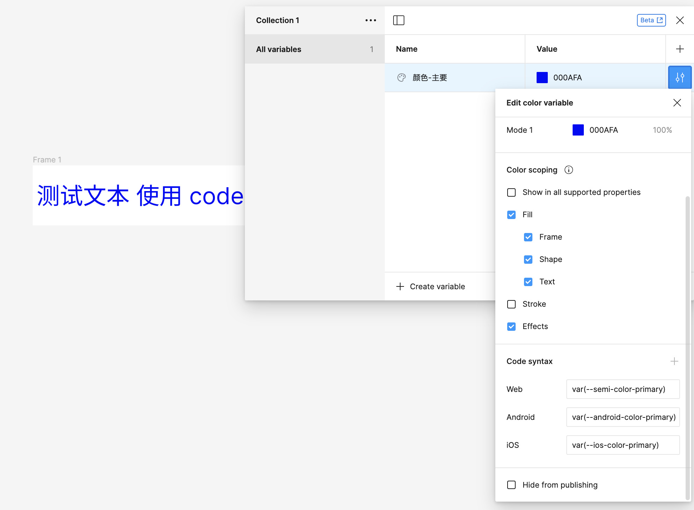
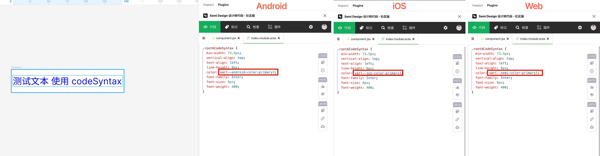
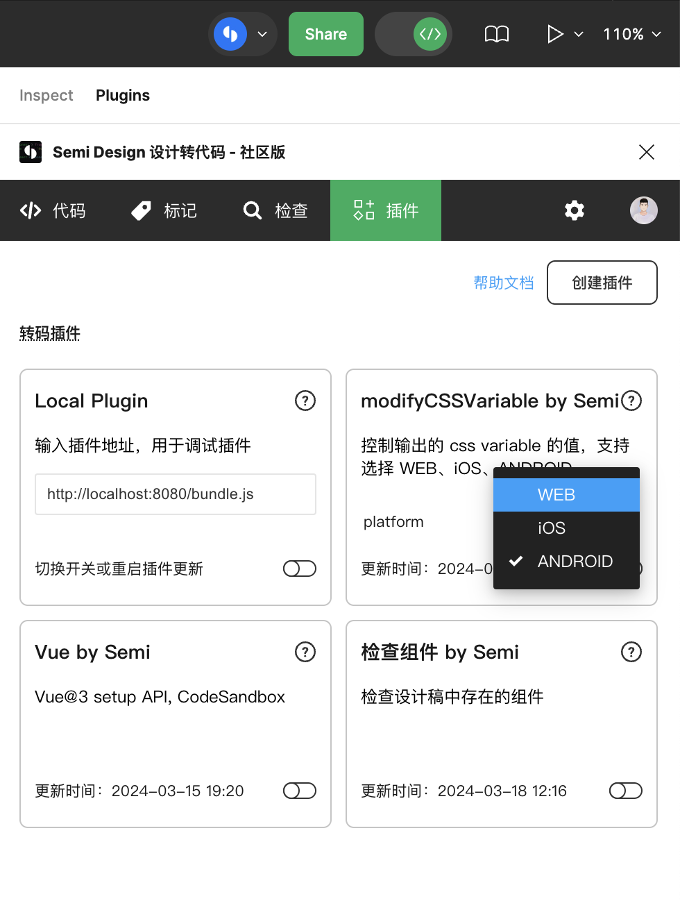

# semi-d2c-plugin-css-variable

一个 Semi D2C 插件，可用于控制输出的 css variable 的值

| 定义                          | 不同平台输出            |
| ----------------------------- | ----------------------- |
|  |  |

## 实现

使用 modifyCSSVariable 钩子干预生成 css variable 的值。

使用插件参数选择出码环境为 WEB、iOS 或 ANDROID。



# 如何创建自己的转码插件？

```bash
# 社区用户
mkdir semi-d2c-plugin && cd semi-d2c-plugin
npm init @douyinfe/semi-d2c-plugin

# 字节内网用户
mkdir semi-d2c-plugin && cd semi-d2c-plugin
npm init @ies/semi-d2c-plugin-starter
```
